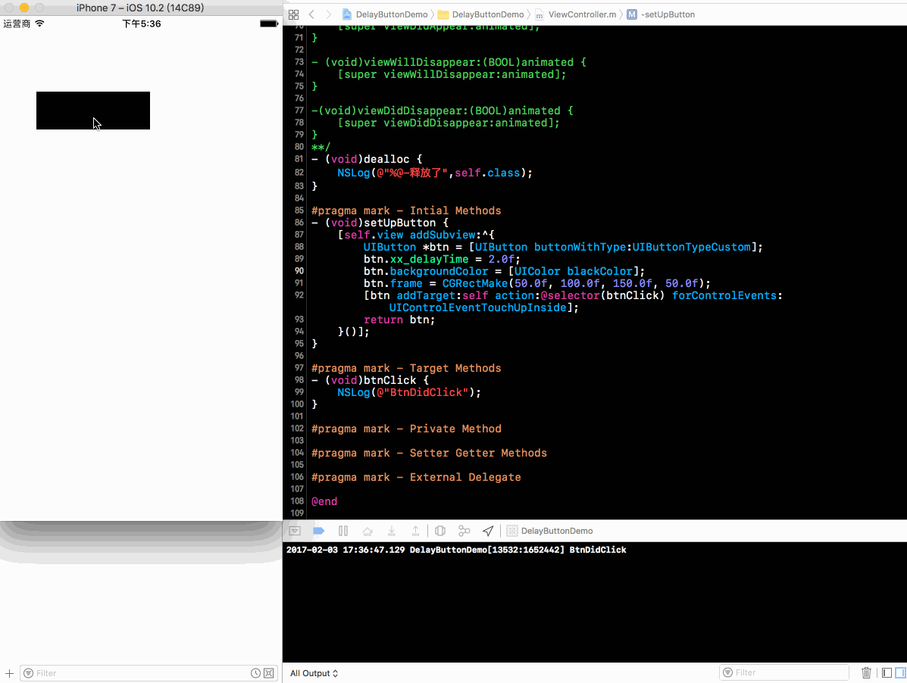
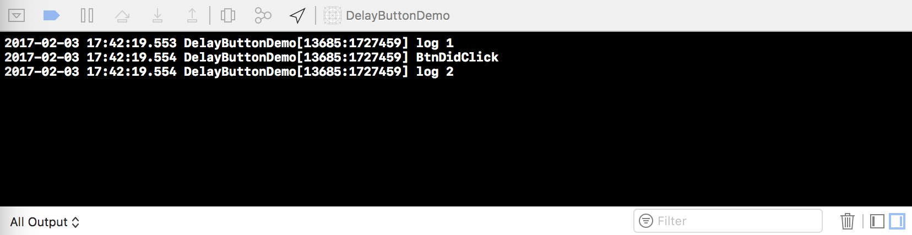

# Method Swizzling 实战：优雅的延迟按钮回调

话不多说，我们先来看下效果：



我们可以发现按钮的用法和系统一样，只是多设置了个`xx_delayTime`为`2.0f秒`，下面的打印时间间隔也是对的，优雅！

在我们看下去之前先抛个问题：

> **是谁包装 UIButton 的点击事件消息，并完成发送消息？**

搞懂这个问题很关键，如果我们知道了具体包装事件消息的地方以及发送按钮点击事件的时机，那么我们就可以拦截它，决定它是在我们想要的时间返回内发送消息还是继续发送信息。

`UIButton`继承自`UIControl`，我们很容易就可以在`UIControl`头文件中找到下面的方法：

```objc
// send the action. the first method is called for the event and is a point at which you can observe or override behavior. it is called repeately by the second.
- (void)sendAction:(SEL)action to:(nullable id)target forEvent:(nullable UIEvent *)event;
```
我们直接上代码看看调用顺序：

```objc
@implementation TestButton
- (void)sendAction:(SEL)action to:(id)target forEvent:(UIEvent *)event {
    NSLog(@"log1");
    [super sendAction:action to:target forEvent:event];
    NSLog(@"log2");
}
@end
```

调用：

```objc
- (void)setUpButton {
    [self.view addSubview:^{
        TestButton *btn = [TestButton buttonWithType:UIButtonTypeCustom];
        btn.backgroundColor = [UIColor blackColor];
        btn.frame = CGRectMake(50.0f, 100.0f, 150.0f, 50.0f);
        [btn addTarget:self action:@selector(btnClick) forControlEvents:UIControlEventTouchUpInside];
        return btn;
    }()];
}

- (void)btnClick {
    NSLog(@"BtnDidClick");
}
```
打印结果：



果不其然：`sendAction:to:forEvent:`调用优先级较高，它包装了按钮的点击事件消息并完成消息发送！

知道调用顺序就好办了，我们利用 `Method Swizzling` hook 住`sendAction:to:forEvent:`做一些事情就行了：

```objc
//.h

#import <UIKit/UIKit.h>

@interface UIControl (DelayEvent)

@property (assign, nonatomic) NSTimeInterval xx_delayTime;

@end

```

```objc
//.m

#import "UIControl+DelayEvent.h"
#import <objc/runtime.h>

@implementation UIControl (DelayEvent)

- (NSTimeInterval)xx_delayTime {
    return [objc_getAssociatedObject(self, _cmd) doubleValue];
}

- (void)setXx_delayTime:(NSTimeInterval)xx_delayTime {
    objc_setAssociatedObject(self,
                             @selector(xx_delayTime),
                             @(xx_delayTime),
                             OBJC_ASSOCIATION_RETAIN_NONATOMIC);
}

- (BOOL)xx_ignoreEvent {
    return [objc_getAssociatedObject(self, _cmd) boolValue];
}

- (void)setXx_ignoreEvent:(BOOL)xx_ignoreEvent {
    objc_setAssociatedObject(self,
                             @selector(xx_ignoreEvent),
                             @(xx_ignoreEvent),
                             OBJC_ASSOCIATION_RETAIN_NONATOMIC);
}

+ (void)load {
    static dispatch_once_t onceToken;
    dispatch_once(&onceToken, ^{
        SEL mySEL = @selector(xx_sendAction:to:forEvent:);
        SEL systemSEL = @selector(sendAction:to:forEvent:);
        Class class = [self class];
        Method myM = class_getInstanceMethod(class, mySEL);
        Method systemM = class_getInstanceMethod(class, systemSEL);
        BOOL success = class_addMethod(class,
                                       mySEL,
                                       method_getImplementation(systemM),
                                       method_getTypeEncoding(systemM));
        if (success) {
            class_replaceMethod(class,
                                systemSEL,
                                method_getImplementation(myM),
                                method_getTypeEncoding(myM));
        }else {
            method_exchangeImplementations(myM, systemM);
        }
    });
}

- (void)xx_sendAction:(SEL)action to:(id)target forEvent:(UIEvent *)event {
    
    if (self.xx_ignoreEvent) return;
    if (self.xx_delayTime > 0.0f) {
        self.xx_ignoreEvent = YES;
        [self performSelector:@selector(setXx_ignoreEvent:)
                   withObject:@(NO)
                   afterDelay:self.xx_delayTime];
    }
    
    [self xx_sendAction:action to:target forEvent:event];
}

@end

```

> 我这里在`UIControl+DelayEvent.h`分类里重写了`sendAction:to:forEvent:`方法，定义了`xx_ignoreEvent`这个`Bool`变量，并根据是否需要延迟也就是`xx_delayTime`变量的值，来决定是否需要通过`performSelector:withObject:afterDelay:`来延迟调用。

上面这段代码还牵扯到`Runtime`两个知识点：

* **Method Swizzling**
* **Associated Objects**
					
关于`Method Swizzling`可以看看我之前的一篇 blog：[浅谈 Method Swizzling](http://blog.ifelseboyxx.com/2017/01/25/Method-Swizzling/)

关于`Associated Objects`可以看看 [雷神](http://blog.leichunfeng.com/) 的这篇 blog：[Objective-C Associated Objects 的实现原理](http://blog.leichunfeng.com/blog/2015/06/26/objective-c-associated-objects-implementation-principle/)

最后说个我困惑很久答案却让我莞尔一笑的问题：

> Associated Objects 的 `key 值` **为什么在`getter`方法里面用`_cmd `，而在`setter`方法里面却用`@selector(xxx)`，为什么不都用`_cmd`？**

`_cmd`表示当前方法的 `selector`，正如同`self`表示当前方法调用的对象实例一样。在 Associated Objects 中，**绑定同一个属性`setter`和`getter`肯定用的是同一个`key值`！**

我们来打印看看就明白了：

```objc
- (NSTimeInterval)xx_delayTime {
    NSLog(@"getter “_cmd”     -> %@",NSStringFromSelector(_cmd));
    NSLog(@"getter “selector” -> %@",NSStringFromSelector(@selector(xx_delayTime)));
    return [objc_getAssociatedObject(self, _cmd) doubleValue];
}

- (void)setXx_delayTime:(NSTimeInterval)xx_delayTime {
    NSLog(@"setter “_cmd”     -> %@",NSStringFromSelector(_cmd));
    objc_setAssociatedObject(self,
                             @selector(xx_delayTime),
                             @(xx_delayTime),
                             OBJC_ASSOCIATION_RETAIN_NONATOMIC);
}
```

打印结果如下：

```objc
2017-02-03 21:56:07.366 DelayButtonDemo[980:43300] setter “_cmd”     -> setXx_delayTime:
2017-02-03 21:56:21.193 DelayButtonDemo[980:43300] getter “_cmd”     -> xx_delayTime
2017-02-03 21:56:21.194 DelayButtonDemo[980:43300] getter “selector” -> xx_delayTime
```

> `setter`里面如果用`_cmd`打印出来是`setXx_delayTime:`，这样上面的问题也就迎刃而解了!

