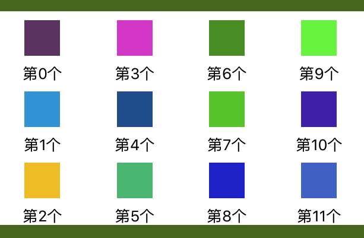
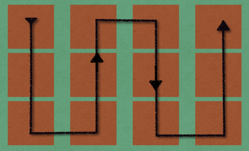
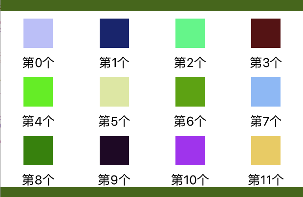

# UICollectionViewFlowLayout 中的一些问题	
最近做一个需求用到了 `UICollectionView` 中的 `UICollectionViewFlowLayout `，大概就是下面这种界面：


这种需求其实非常常见了，正常都直接用个 `UICollectionView` 来实现，指定好每个 `item` 大小，设置水平滚动，也就是 `UICollectionViewScrollDirectionHorizontal` 就行。然后我噼里啪啦键盘一顿狂敲，跑起来一看：



看起来好像没什么问题的样子？但是仔细看看，其实系统的 `UICollectionViewFlowLayout `流水布局在 `UICollectionViewScrollDirectionHorizontal ` 情况下，数据排列是**从左往右垂直排列**的：



这肯定不是我们想要的，我们想要的是**从左往右水平**排列！！！这时候只能自定义`UICollectionViewFlowLayout `了。

因为大小都是固定的，为了性能考虑，我们直接在 `prepareLayout ` 方法计算好每个 `item` 的`frame`，并存放到 `_attributesArr ` 数组中去：

```objc
- (void)prepareLayout {
    [super prepareLayout];
    
    //提前缓存好各个 item frame
    
    if (!_attributesArr) {
        _attributesArr = [NSMutableArray array];
    }
    NSInteger item = [self.collectionView numberOfItemsInSection:0];
    CGFloat width = [UIScreen mainScreen].bounds.size.width / PageTotalCol;
    
    for (int i = 0; i < item; i++) {
        UICollectionViewLayoutAttributes *attributes = [UICollectionViewLayoutAttributes layoutAttributesForCellWithIndexPath:[NSIndexPath indexPathForRow:i inSection:0]];
        CGRect frame = attributes.frame;
        
        int x = i/PageTotalCount;
        frame.origin.x = (x*self.collectionView.bounds.size.width) + (i%PageTotalCol)*width;
        
        int y = i/PageTotalCol;
        frame.origin.y = (y%PageTotalRow)*ItemHeight;
        
        frame.size = CGSizeMake(width, ItemHeight);
        
        attributes.frame = frame;
        [_attributesArr addObject:attributes];
    }
}

```

然后直接重写 `layoutAttributesForElementsInRect:` 方法，直接返回 `_attributesArr ` 数组：

```objc
- (nullable NSArray<__kindof UICollectionViewLayoutAttributes *> *)layoutAttributesForElementsInRect:(CGRect)rect {
    return _attributesArr;
}
```

接着重写 `collectionViewContentSize` 方法，根据数据及自己的需求返回 `collectionView` 的 `contentSize`：

```objc
- (CGSize)collectionViewContentSize {
    //计算好 ContentSize
    NSInteger item = [self.collectionView numberOfItemsInSection:0];
    return CGSizeMake(ceil(item/PageTotalCount)*self.collectionView.frame.size.width, self.collectionView.frame.size.height);
}
```

最后把系统的 `UICollectionViewFlowLayout ` 替换成我们自己的布局就行了，效果如下：




