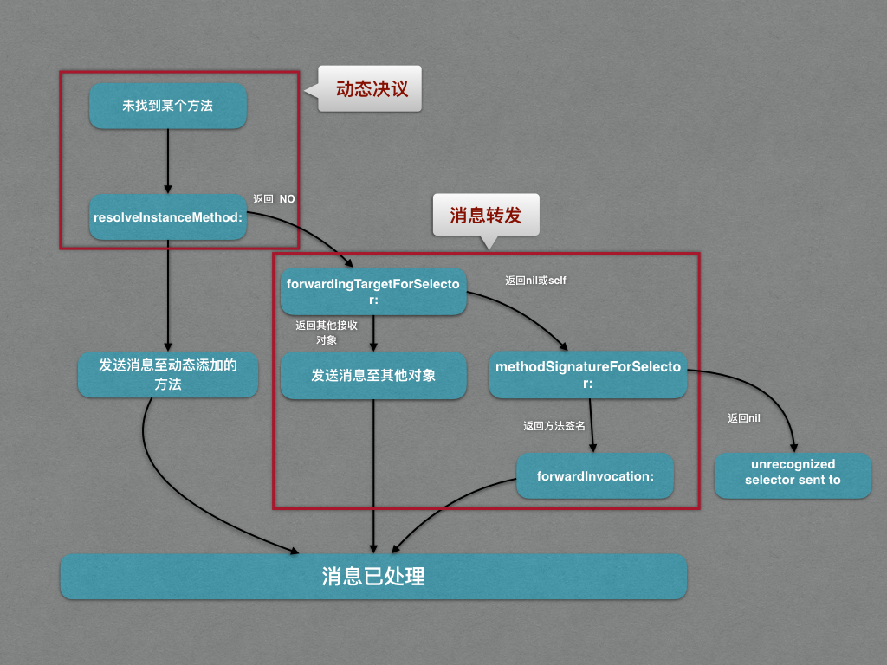

# Objective-C 之多重代理

在 Objective-C 中，经常使用 delegate 来实现对象之间通信，但是 delegate 一般是对象间一对一的通信，对于一对多的场景我们常用的是 KVO 以及通知中心。那么有些特殊的场景下，比如多个对象监听 UITableView 的滚动，这时候我们就需要思考如何实现 delegate 的一对多：


## 动态方法决议与消息转发

在 Objective-C 中，如果向一个对象发送一条该对象无法处理的消息，会导致程序 crash：

```objc
//.h

@interface XXViewOne : UIView
- (void)xx;
@end

//.m
@implementation XXViewOne

@end

```
如果我们直接调用 `xx` 方法：

```objc
XXViewOne *one = [XXViewOne new];
[one xx];
```

就会报如下错误：

```objc
2017-04-11 19:24:15.826 MultipleDelegateDemo[8189:13619859] -[XXViewOne xx]: unrecognized selector sent to instance 0x7feaed404ee0
2017-04-11 19:24:15.829 MultipleDelegateDemo[8189:13619859] *** Terminating app due to uncaught exception 'NSInvalidArgumentException', reason: '-[XXViewOne xx]: unrecognized selector sent to instance 0x7feaed404ee0'
```

但是，在 crash 之前，oc 的运行时系统会先经过以下两个步骤：

* Dynamic Method Resolution
* Message Forwarding

### Dynamic Method Resolution（动态方法决议）

如果我们调用的是实例方法（-），会先调用下面的方法：

```objc
+ (BOOL)resolveInstanceMethod:(SEL)sel {
    BOOL hasSel = [super resolveInstanceMethod:sel];
    return hasSel;
}
```

如果我们调用的是静态方法（+），会先调用下面的方法：

```objc
+ (BOOL)resolveClassMethod:(SEL)sel {
    BOOL hasSel = [super resolveClassMethod:sel];
    return hasSel;
}
```
这个我们就有机会在程序运行时，动态的为一个 SEL 提供实现：

```objc
+ (BOOL)resolveInstanceMethod:(SEL)sel {
    if (sel == @selector(xx)) {
        class_addMethod(self.class, sel, (IMP)DynamicMethodIMP, "v@:");
        return YES;
    }
    BOOL hasSel = [super resolveInstanceMethod:sel];
    return hasSel;
}

void DynamicMethodIMP(id self, SEL _cmd) {
    NSLog(@"%@",NSStringFromSelector(_cmd));
}

```

这样，即使我们没有实现  `xx` 方法也不会 crash，因为我们已经在运行时动态的添加好了对应的实现。如果我们没有动态的添加实现并且 `resolveInstanceMethod:` 返回 `NO`，就会进入下一步消息转发（Message Forwarding）。

### Message Forwarding（消息转发）

首先会先调用下面的方法：

```objc
- (id)forwardingTargetForSelector:(SEL)aSelector {
    id sel = [super forwardingTargetForSelector:aSelector];
    return sel;
}
```

如果这个方法中返回的不是 nil 或者 self，运行时系统将把消息发送给返回的那个对象。如果我们返回另一个实现 `xx` 方法的对象：

```objc
//XXViewOne.m

- (id)forwardingTargetForSelector:(SEL)aSelector {
    XXViewTwo *twoObjc = [XXViewTwo new];
    if ([twoObjc respondsToSelector:aSelector]) {
        return twoObjc;
    }
    return [super forwardingTargetForSelector:aSelector];
}


//XXViewTwo.m

@implementation XXViewTwo
- (void)xx {
    NSLog(@"%@ _ xx",self.class);
}
@end

```

可以看到消息成功的转发到 `XXViewTwo` 对象中：

```objc
2017-04-11 20:12:31.526 MultipleDelegateDemo[8774:13826022] XXViewTwo _ xx
```

如果返回 nil 或者 self，运行时系统会接着调用：

```objc
- (NSMethodSignature *)methodSignatureForSelector:(SEL)aSelector {
    NSMethodSignature *signature = [super methodSignatureForSelector:aSelector];
    return signature;
}
```

上面的方法返回方法签名，方法签名记录了方法的参数和返回值的信息。这是最后一个寻找 IMP 的机会，如果返回 nil 就会抛出 `unrecognized selector sent to instance` 结束了；否则会接着调用下面的方法：

```objc
- (void)forwardInvocation:(NSInvocation *)anInvocation {}
```

相比于 `forwardingTargetForSelector:` 方法的只能以 selector 的形式转向一个对象，在这个函数里可以将 NSInvocation 多次转发到多个对象中，这就使得我们可以利用这个来实现 delegate 的一对多。

整个流程图如下：




## 实现多重代理

```objc
//MultipleDelegateHelper.h

@interface MultipleDelegateHelper : NSObject

@property (nonatomic, strong, nonnull) NSArray *delegateTargets;

@end
```

```objc
//MultipleDelegateHelper.m

#import "MultipleDelegateHelper.h"

@interface MultipleDelegateHelper ()

@property (nonatomic, strong, nonnull) NSPointerArray *weakTargets;

@end

@implementation MultipleDelegateHelper

- (NSPointerArray *)weakTargets {
    if (!_weakTargets) {
        _weakTargets = [NSPointerArray weakObjectsPointerArray];
    }
    return _weakTargets;
}

- (void)setDelegateTargets:(NSArray *)delegateTargets{
    for (id delegate in delegateTargets) {
        [self.weakTargets addPointer:(__bridge void * _Nullable)(delegate)];
    }
}

- (BOOL)respondsToSelector:(SEL)aSelector{
    if ([super respondsToSelector:aSelector]) {
        return YES;
    }
    for (id target in self.weakTargets) {
        if ([target respondsToSelector:aSelector]) {
            return YES;
        }
    }
    return NO;
}

- (NSMethodSignature *)methodSignatureForSelector:(SEL)aSelector{
    NSMethodSignature *sig = [super methodSignatureForSelector:aSelector];
    if (!sig) {
        for (id target in self.weakTargets) {
            if ((sig = [target methodSignatureForSelector:aSelector])) {
                break;
            }
        }
    }
    return sig;
}

- (void)forwardInvocation:(NSInvocation *)anInvocation{
    for (id target in self.weakTargets) {
        if ([target respondsToSelector:anInvocation.selector]) {
            [anInvocation invokeWithTarget:target];
        }
    }
}

@end

```

因为 NSArray 会对对象进行 retain 操作，导致循环引用的产生，所以我们可以用 NSPointerArray 来解决这个问题，但是对象也需要强引用 `MultipleDelegateHelper` 对象。

#### 参考链接

[继承自NSObject的不常用又很有用的函数（2）
](http://www.cnblogs.com/biosli/p/NSObject_inherit_2.html)

[利用OC的动态方法决议与消息转发机制实现多重代理](http://zziking.github.io/2015/11/01/%E5%88%A9%E7%94%A8OC%E7%9A%84%E5%8A%A8%E6%80%81%E6%96%B9%E6%B3%95%E5%86%B3%E8%AE%AE%E4%B8%8E%E6%B6%88%E6%81%AF%E8%BD%AC%E5%8F%91%E6%9C%BA%E5%88%B6%E5%AE%9E%E7%8E%B0%E5%A4%9A%E9%87%8D%E4%BB%A3%E7%90%86.html)
