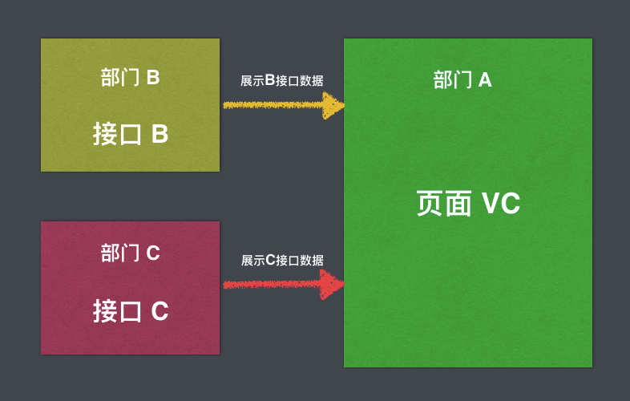
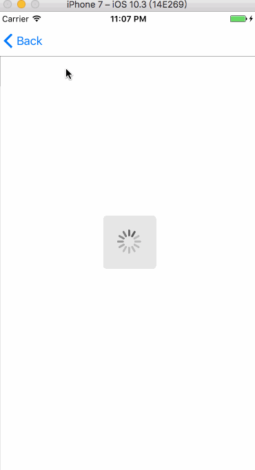

# 利用多态及协议多重继承统一接口数据格式

开始之前先简单说下需求：首先，页面样式由`A部门`负责，但是页面的数据依赖于`B部门`和`C部门`，`B、C`都有自己的唯一标识`projectTag`并且都有自己的接口，接口字段都不相同，他们的关系如下图：



在这种关系结构下就会导致一个问题：`B接口`和`C接口`都有自己数据格式，`A部门`的页面到底用哪个接口？总不能用`if else`判断吧？万一还有`部门D`、`部门E`呢？

## 利用协议实现多重继承

首先我们新建个协议 `PublicProtocol.h`，这个协议定义了`页面VC`所需要的数据元素（这里一般都定义成 `readonly `，不允许外部修改）：

```objc
#ifndef PublicProtocol_h
#define PublicProtocol_h

@protocol DataInfoProtocol <NSObject>
@required
/** title */
@property (copy, nonatomic, readonly) NSString *title;
@optional
/** subTitle */
@property (copy, nonatomic, readonly) NSString *subTitle;
@end

#endif /* PublicProtocol_h */
```

然后我们在`部门A`和`部门B`的接口`Model`中实现这个协议并返回所需要的数据：

```objc
//ClassAModel.h

#import <Foundation/Foundation.h>
#import "PublicProtocol.h"

@interface ClassAModel : NSObject
<DataInfoProtocol>

/** titleA */
@property (copy, nonatomic) NSString *titleA;

/** subTitleA */
@property (copy, nonatomic) NSString *subTitleA;

@end
```

```objc
//

#import "ClassAModel.h"

@implementation ClassAModel

#pragma mark - DataInfoProtocol setter

- (NSString *)title {
    return self.titleA;
}

- (NSString *)subTitle {
    return self.subTitleA;
}

@end

```

`部门B`的接口`Model`也类似：

```objc
//ClassBModel.h

#import <Foundation/Foundation.h>
#import "PublicProtocol.h"

@interface ClassBModel : NSObject
<DataInfoProtocol>

/** titleB */
@property (copy, nonatomic) NSString *titleB;

/** subTitleB */
@property (copy, nonatomic) NSString *subTitleB;

@end
```

```objc
//ClassBModel.m

#import "ClassBModel.h"

@implementation ClassBModel
#pragma mark - DataInfoProtocol setter

- (NSString *)title {
    return self.titleB;
}

- (NSString *)subTitle {
    return self.subTitleB;
}

@end

```

这样我们就解决了不同接口参数不一样的问题，统一了接口字段。接着我们还有个问题：

**该怎么传递数据给`页面VC`？**

## 利用多态特性传递数据

首先我们新建个抽象数据源基类 `BaseClass.h`，里面定义好 `页面VC`所需要的数据源：

```objc
//BaseClass.h

#import "PublicProtocol.h"

@interface BaseClass : NSObject

/** 数据源*/
@property (strong, nonatomic) NSArray <id<DataInfoProtocol>> *dataList;

/** 接口请求操作*/
- (void)fetchDataWithCompletionHandler:(void(^)())completeBlock;
@end

```

这里返回的数据源是一个实现 `DataInfoProtocol ` 协议的对象数组 `dataList `。

接着每个部门都包含一个`BaseClass`的子类，比如 `部门A` 的数据源类 `ClassA.h`：

```objc
//ClassA.h

#import "BaseClass.h"

@interface ClassA : BaseClass

@end

```

```objc
//ClassA.m

#import "ClassA.h"
#import "ClassAModel.h"

@implementation ClassA

- (void)fetchDataWithCompletionHandler:(void (^)())completeBlock {
    
    //模拟请求接口操作
    dispatch_after(dispatch_time(DISPATCH_TIME_NOW, (int64_t)(2.0f * NSEC_PER_SEC)), dispatch_get_main_queue(), ^{
        
        NSDictionary *tempDict = @{@"titleA"    : @"Jhons",
                                   @"subTitleA" : @"iOS dev"};
        ClassAModel *aModel = [ClassAModel classAModelWithDict:tempDict];
        self.dataList = @[aModel];
        
        completeBlock();
    });
    
}

- (void)dealloc {
    NSLog(@"%@dealloc",self.class);
}

@end

```

这里模拟了请求接口，返回了 `A接口` 的数据源，`B部门` 也类似。

接着，我们申明抽象数据源类 `BaseClass`：

```objc
/** Data Class */
@property (strong, nonatomic) BaseClass *dataClass;
```

然后我们就可以根据每个部门的`projectTag`标识，来创建不同的数据源类：

```objc
- (void)viewWillAppear:(BOOL)animated {
    [super viewWillAppear:animated];
    
    NSString *plistPath = [[NSBundle mainBundle] pathForResource:@"ProjectMaps" ofType:@"plist"];
    NSDictionary *dictionary = [[NSDictionary alloc] initWithContentsOfFile:plistPath];
    self.dataClass = [NSClassFromString(dictionary[self.projectTag]) new];
    
    [MBProgressHUD showHUDAddedTo:self.view animated:YES];
    [self.dataClass fetchDataWithCompletionHandler:^{
        [MBProgressHUD hideHUDForView:self.view animated:YES];
        [self.tvDetial reloadData];
    }];
}
```

这里我用了个 `ProjectMaps.plist`，来根据每个项目的`projectTag ` 标识，定义好数据源类：


写的例子比较简单，但是设计思路应该很明白了，具体效果如下：



### 写在最后

可能这并不是最后的设计模式，如果有更好地，希望能一起讨论下 ^ ^


