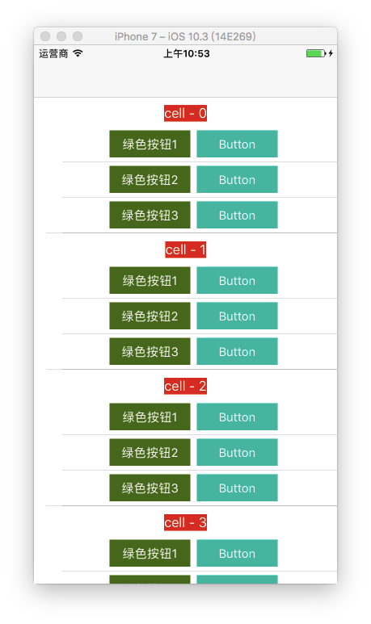

> 首先感谢下 [Tian Wei Yu](https://casatwy.com/pages/about-me.html) 的 [[一种基于ResponderChain的对象交互方式](https://casatwy.com/responder_chain_communication.html)](https://casatwy.com/responder_chain_communication.html) 这篇文章，让我知道对象间的交互还有这种姿势。说实话，第一遍没看懂，自己跟着敲了一遍才理解，所以有了这篇文章，算是个记录。


### 前言

Responder Chain ，也就是响应链，关于这方面的知识因为不是本文重点，还不太理解的可以去看看这篇文章：[史上最详细的iOS之事件的传递和响应机制-原理篇](http://www.jianshu.com/p/2e074db792ba)。

在 iOS 中，对象间的交互模式大概有这几种：直接 property 传值、delegate、KVO、block、protocol、多态、Target-Action 等等，本文介绍的是一种基于 UIResponder 对象交互方式，简而言之，就是 通过在 UIResponder上挂一个 category，使得事件和参数可以沿着 responder chain 逐步传递。对于那种 subviews 特别多，事件又需要层层传递的层级视图特别好用，但是，缺点也很明显，必须依赖于 UIResponder 对象。


### 具体事例

我们先来看看下面这种很常见的界面：



简单讲解下：最外层是个 UITableView，我们就叫做 SuperTable，每个 cell 里面又嵌套了个 UITableView，叫做 SubTable，然后这个 SubTable 的 cell 里面有一些按钮，我们理一下这个界面的层级：


> UIViewController -> SuperTable -> SuperCell -> SubTable -> SubCell -> UIButton


如果我们需要在最外层的 UIViewController 里捕获到这些按钮的点击事件，比如点击按钮需要刷新 SuperTable，这时候该怎么实现呢？

方法有很多，最常见的就是 delegate ，但是因为层级太深，导致我们需要一层层的去实现，各种  protocol、delegate 声明，很繁琐，这种时候，基于 Responder Chain 就很方便了。


### 具体使用

只需要一个 UIResponder 的 category 就行：

```objc
@interface UIResponder (Router)

- (void)routerEventWithSelectorName:(NSString *)selectorName
                     object:(id)object
                   userInfo:(NSDictionary *)userInfo;


@end
```


```objc
@implementation UIResponder (Router)

- (void)routerEventWithSelectorName:(NSString *)selectorName
                             object:(id)object
                           userInfo:(NSDictionary *)userInfo {
    
    [[self nextResponder] routerEventWithSelectorName:selectorName
                                       object:object
                                     userInfo:userInfo];
    
}

@end
```


最里层 UIButton 的点击处理：

```objc
- (IBAction)btnClick1:(UIButton *)sender {
    
    [self routerEventWithSelectorName:@"btnClick1:userInfo:" object:sender userInfo:@{@"key":@"蓝色按钮"}];
    
}
```


外层 UIViewController 的接收：

```obj
- (void)routerEventWithSelectorName:(NSString *)selectorName
                     object:(id)object
                   userInfo:(NSDictionary *)userInfo {
        
    SEL action = NSSelectorFromString(selectorName);
    
    NSMutableArray *arr = [NSMutableArray array];
    if(object) {[arr addObject:object];};
    if(userInfo) {[arr addObject:userInfo];};
    
    [self performSelector:action withObjects:arr];

}
```


事件响应：

```objc
- (void)btnClick1:(UIButton *)btn userInfo:(NSDictionary *)userInfo {
    
    NSLog(@"%@  %@",btn,userInfo);
    
}
```


如果想在传递过程中新增参数，比如想在 SuperCell 这一层加点参数，只需要在对应的地方实现方法就行：

```objc
- (void)routerEventWithSelectorName:(NSString *)selectorName object:(id)object userInfo:(NSDictionary *)userInfo {
    
    NSMutableDictionary *mDict = [userInfo mutableCopy];
    mDict[@"test"] = @"测试";

    [super routerEventWithSelectorName:selectorName object:object userInfo:[mDict copy]];
}
```


### 设计思路

```objc
- (void)routerEventWithSelectorName:(NSString *)selectorName
                     object:(id)object
                   userInfo:(NSDictionary *)userInfo
```

细心的可以发现，我这里直接把 `SEL`  设计成以 `NSString` 的形式传递了，再在外面通过 `NSSelectorFromString(selectorName)` 转成对应的 `SEL`。原文中传的是个用来标识具体是哪个事件的字串，还需要维护专门的 `NSDictionary` 来找到对应的事件，我觉得太麻烦，但是好处是 `@selector(....)` 声明和实现在一个地方，可读性高，也不容易出现拼写错误，导致触发不了对应方法的问题，具体怎么设计，大家见仁见智吧~

关于参数的传递，比如我触发 `UITableViewDelegate` 中的 `didSelectRowAtIndexPath:` 方法，`<2`  个参数的情况，`performSelector:` 方法也可以满足，但一旦 `>2` 个参数的话，就不行了，这时候我们就可以用 `NSInvocation` 来实现，我写了个分类，支持传递多个参数，搭配使用很方便：


```objc
@interface NSObject (PerformSelector)

- (id)performSelector:(SEL)aSelector withObjects:(NSArray <id> *)objects;

@end
```


```objc
@implementation NSObject (PerformSelector)

- (id)performSelector:(SEL)aSelector
          withObjects:(NSArray <id> *)objects {
    
    //创建签名对象
    NSMethodSignature *signature = [[self class] instanceMethodSignatureForSelector:aSelector];
    
    //判断传入的方法是否存在
    if (!signature) { //不存在
        //抛出异常
        NSString *info = [NSString stringWithFormat:@"-[%@ %@]:unrecognized selector sent to instance",[self class],NSStringFromSelector(aSelector)];
        @throw [[NSException alloc] initWithName:@"ifelseboyxx remind:" reason:info userInfo:nil];
        return nil;
    }
    
    //创建 NSInvocation 对象
    NSInvocation *invocation = [NSInvocation invocationWithMethodSignature:signature];
    
    //保存方法所属的对象
    invocation.target = self;
    invocation.selector = aSelector;

    
    //设置参数
    //存在默认的 _cmd、target 两个参数，需剔除
    NSInteger arguments = signature.numberOfArguments - 2;
    
    //谁少就遍历谁,防止数组越界
    NSUInteger objectsCount = objects.count;
    NSInteger count = MIN(arguments, objectsCount);
    for (int i = 0; i < count; i++) {
        id obj = objects[i];
        //处理参数是 NULL 类型的情况
        if ([obj isKindOfClass:[NSNull class]]) {obj = nil;}
        [invocation setArgument:&obj atIndex:i+2];
    }
    
    //调用
    [invocation invoke];
    
    //获取返回值
    id res = nil;
    //判断当前方法是否有返回值
    if (signature.methodReturnLength != 0) {
        [invocation getReturnValue:&res];
    }
    return res;
}

@end
```


最后附上 [Demo](https://github.com/ifelseboyxx/xx_Notes/tree/master/contents/ResponderChain/ResponderChainDemo)

