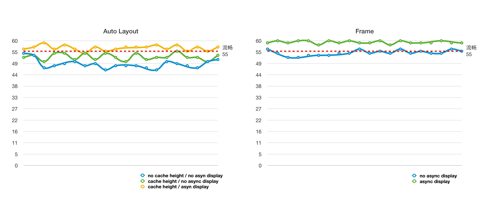
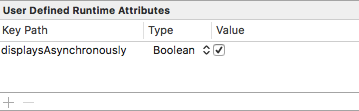
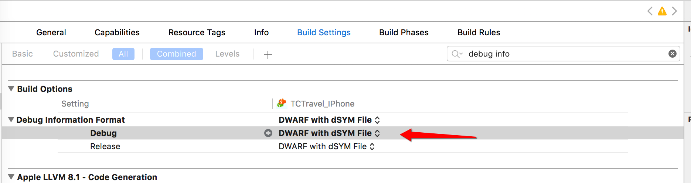

## iOS 中关于列表滚动流畅方案的一些探讨

近些年，App 越来越推崇体验至上，随随便便乱写一通的话已经很难让用户买帐了，顺滑的列表便是其中很重要的一点。如果一个 App 的页面滚动起来总是卡顿卡顿的，轻则被当作反面教材来吐槽或者衬托“我们的 App balabala...”，重则直接卸载。正好最近在优化这一块儿，总结记录下。

如果说有什么好的博客文章推荐，ibireme  的  [iOS 保持界面流畅的技巧](https://blog.ibireme.com/2015/11/12/smooth_user_interfaces_for_ios/) 这篇堪称经典，墙裂推荐反复阅读。这篇文章中讲解了很多的优化点，我自己总结了下收益最大的两个优化点：

* 避免重复多次计算 cell 行高
* 文本异步渲染




大家可以看看上面这张图的对比分析，数据是 iPhone6 的机子用 instruments 抓的，左边的是用 Auto Layout 绘制界面的数据分析，正常如果想平滑滚动的话，fps 至少需要稳定在 55 左右，我们可以发现，在没有缓存行高和异步渲染的情况下 fps 是最低的，可以说是比较卡顿了，至少是能肉眼感觉出来，能满足平滑滚动要求的也只有在缓存行高且异步渲染的情况下；右边的是没用 Auto Layout 直接用 frame 来绘制界面的数据分析，可以发现即使没有异步渲染，也能勉强满足平滑滚动的要求，如果开启异步渲染的话，可以说是相当的丝滑了。


### 避免重复多次计算 cell 行高

TableView 行高计算可以说是个老生常谈的问题了，`heightForRowAtIndexPath:`  是个调用相当频繁的方法，在里面做过多的事情难免会造成卡顿。 在 iOS 8 中，我们可以通过设置下面两个属性来很轻松的实现高度自适应：

```objc
self.tableView.estimatedRowHeight = 88;
self.tableView.rowHeight = UITableViewAutomaticDimension;
```
虽然很方便，不过如果你的页面对性能有一定要求，建议不要这么做，具体可以看看 sunnyxx 的 [优化UITableViewCell高度计算的那些事](http://blog.sunnyxx.com/2015/05/17/cell-height-calculation/)。文中针对 Auto Layout，提供了个 cell 行高的缓存库 [UITableView-FDTemplateLayoutCell](https://github.com/forkingdog/UITableView-FDTemplateLayoutCell)，可以很好的帮助我们避免 cell 行高多次计算的问题。

如果不使用 Auto Layout，我们可以在请求完拿到数据后提前计算好页面每个控件的 frame 和 cell 高度，并且缓存在内存中，用的时候直接在 `heightForRowAtIndexPath:` 取出计算好的值就行，大概流程如下：

* 模拟请求数据回调：

```objc
- (void)viewDidLoad {
[super viewDidLoad];

[self buildTestDataThen:^(NSMutableArray <FDFeedEntity *> *entities) {
self.data = @[].mutableCopy;
@autoreleasepool {
for (FDFeedEntity *entity in entities) {
FrameModel *frameModel = [FrameModel new];
frameModel.entity = entity;
[self.data addObject:frameModel];
}
}
[self.tvFeed reloadData];
}];
}
```

* 一个简单计算 frame 、cell 行高方式：

```objective-c
//FrameModel.h

@interface FrameModel : NSObject

@property (assign, nonatomic, readonly) CGRect titleFrame;
@property (assign, nonatomic, readonly) CGFloat cellHeight;
@property (strong, nonatomic) FDFeedEntity *entity;

@end
```

```objective-c
//FrameModel.m

@implementation FrameModel

- (void)setEntity:(FDFeedEntity *)entity {
if (!entity) return;

_entity = entity;

CGFloat maxLayout = ([UIScreen mainScreen].bounds.size.width - 20.f);
CGFloat bottom = 4.f;

//title
CGFloat titleX = 10.f;
CGFloat titleY = 10.f;
CGSize titleSize = [entity.title boundingRectWithSize:CGSizeMake(maxLayout, CGFLOAT_MAX) options:NSStringDrawingUsesLineFragmentOrigin|NSStringDrawingUsesFontLeading attributes:@{NSFontAttributeName : Font(16.f)} context:nil].size;
_titleFrame = CGRectMake(titleX, titleY, titleSize.width, titleSize.height);

//cell Height
_cellHeight = (CGRectGetMaxY(_titleFrame) + bottom);
}

@end
```

* 行高取值：

```objective-c
- (UITableViewCell *)tableView:(UITableView *)tableView cellForRowAtIndexPath:(NSIndexPath *)indexPath {
FrameFeedCell *cell = [tableView dequeueReusableCellWithIdentifier:FrameFeedCellIdentifier forIndexPath:indexPath];
FrameModel *frameModel = self.data[indexPath.row];
cell.model = frameModel;
return cell;
}

- (CGFloat)tableView:(UITableView *)tableView heightForRowAtIndexPath:(NSIndexPath *)indexPath {
FrameModel *frameModel = self.data[indexPath.row];
return frameModel.cellHeight;
}
```

* 控件赋值：

```objective-c
- (void)setModel:(FrameModel *)model {
if (!model) return;

_model = model;

FDFeedEntity *entity = model.entity;

self.titleLabel.frame = model.titleFrame;
self.titleLabel.text = entity.title;
}
```

#### 优缺点

缓存行高方式有现成的库简单方便，虽然 UITableView-FDTemplateLayoutCell 已经处理的很好了，但是 Auto Layout 对性能还是会有部分消耗；手动计算 frame 方式所有的位置都需要计算，比较麻烦，而且在数据量很大的情况下，大量的计算对数据展示时间会有部分影响，相应的回报就是性能会更好一些。


### 文本异步渲染

当显示大量文本时，CPU 的压力会非常大。对此解决方案只有一个，那就是自定义文本控件，用 TextKit 或最底层的 CoreText 对文本异步绘制。尽管这实现起来非常麻烦，但其带来的优势也非常大，CoreText 对象创建好后，能直接获取文本的宽高等信息，避免了多次计算（调整 UILabel 大小时算一遍、UILabel 绘制时内部再算一遍）；CoreText 对象占用内存较少，可以缓存下来以备稍后多次渲染。

幸运的是，想支持文本异步渲染也有现成的库 [YYText](https://github.com/ibireme/YYText) ，下面来讲讲如何搭配它最大程度满足我们如丝般顺滑的需求：

#### Frame 搭配异步渲染

基本思路和计算 frame 类似，只不过把系统的 `boundingRectWithSize:`、 `sizeWithAttributes:` 换成  YYText  中的方法：

* 配置 frame model：

```objective-c
//FrameYYModel.h

@interface FrameYYModel : NSObject

@property (assign, nonatomic, readonly) CGRect titleFrame;
@property (strong, nonatomic, readonly) YYTextLayout *titleLayout;

@property (assign, nonatomic, readonly) CGFloat cellHeight;

@property (strong, nonatomic) FDFeedEntity *entity;

@end
```

```objective-c
//FrameYYModel.m

@implementation FrameYYModel

- (void)setEntity:(FDFeedEntity *)entity {
if (!entity) return;

_entity = entity;

CGFloat maxLayout = ([UIScreen mainScreen].bounds.size.width - 20.f);
CGFloat space = 10.f;
CGFloat bottom = 4.f;

//title
NSMutableAttributedString *title = [[NSMutableAttributedString alloc] initWithString:entity.title];
title.yy_font = Font(16.f);
title.yy_color = [UIColor blackColor];

YYTextContainer *titleContainer = [YYTextContainer containerWithSize:CGSizeMake(maxLayout, CGFLOAT_MAX)];
_titleLayout = [YYTextLayout layoutWithContainer:titleContainer text:title];

CGFloat titleX = 10.f;
CGFloat titleY = 10.f;
CGSize titleSize = _titleLayout.textBoundingSize;
_titleFrame = (CGRect){titleX,titleY,CGSizeMake(titleSize.width, titleSize.height)};

//cell Height
_cellHeight = (CGRectGetMaxY(_titleFrame) + bottom);
}

@end
```

对比上面 frame，可以发现多了个 `YYTextLayout`  属性，这个属性可以提前配置文本的特性，包括 `font`、`textColor` 以及行数、行间距、内间距等等，好处就是可以把一些逻辑提前处理好，比如根据接口字段，动态配置字体颜色，字号等，如果用 Auto Layout，这部分逻辑则不可避免的需要写在  `cellForRowAtIndexPath:` 方法中。

* UITableViewCell 处理 ：

```objective-c
- (instancetype)initWithStyle:(UITableViewCellStyle)style reuseIdentifier:(NSString *)reuseIdentifier {
self = [super initWithStyle:style reuseIdentifier:reuseIdentifier];
if (!self) return nil;

YYLabel *title = [YYLabel new];
title.displaysAsynchronously = YES; //开启异步渲染
title.ignoreCommonProperties = YES; //忽略属性
title.layer.borderColor = [UIColor brownColor].CGColor;
title.layer.cornerRadius = 1.f;
title.layer.borderWidth = 1.f;
[self.contentView addSubview:_titleLabel = title];

return self;
}
```

* 赋值：

```objective-c
- (void)setModel:(FrameYYModel *)model {
if (!model) return;
_model = model;

self.titleLabel.frame = model.titleFrame;
self.titleLabel.textLayout = model.titleLayout; //直接取 YYTextLayout
}
```

#### Auto Layout 搭配异步渲染

YYText  非常友好，同样支持 xib，YYText  继承自 `UIView`，所要做的事情也很简单：

* 在 xib 中配置约束
* 开启异步属性

开启异步属性可以代码里设置，也可以直接在 xib 里设置，分别如下：

```objc
self.titleLabel.displaysAsynchronously = YES;
self.subTitleLabel.displaysAsynchronously = YES;
self.contentLabel.displaysAsynchronously = YES;
self.usernameLabel.displaysAsynchronously = YES;
self.timeLabel.displaysAsynchronously = YES;
```




另外需要注意的一点是，多行文本的情况下需要设置最大换行宽：

```objective-c
CGFloat maxLayout = [UIScreen mainScreen].bounds.size.width - 20.f;
self.titleLabel.preferredMaxLayoutWidth = maxLayout;
self.subTitleLabel.preferredMaxLayoutWidth = maxLayout;
self.contentLabel.preferredMaxLayoutWidth = maxLayout;
```

#### 优缺点

YYText 的异步渲染能极大程度的提高列表流畅度，真正达到如丝般顺滑，但是在开启异步时，刷新列表会有闪烁情况，仔细想想觉得也正常，毕竟是异步的，渲染也需要时间，这里作者给出了一些 [方案](https://github.com/ibireme/YYKit/issues/64)，大家可以看看。

### 其它

#### 关于圆角

列表中如果存在很多系统设置的圆角页面导致卡顿：

```objective-c
label.layer.cornerRadius = 5.f;
label.clipsToBounds = YES;
```

据观察，只要当前屏幕内只要设置圆角的控件个数不要太多（大概十几个算个临界点），就不会引起卡顿。

还有就是只要不设置 `clipsToBounds` 不管多少个，都不会卡顿，比如你需要圆角的控件是白色背景色的，然后它的父控件也是白色背景色的，而且没有点击后高亮的，就没必要 clipsToBounds 了。

#### 如何定位卡顿原因

我们可以利用 instruments 中的 Time Profiler 来帮助我们定位问题位置，选中 Xcode，command + control + i  打开：


我们选中主线程，去掉系统的方法，然后操作一下列表，再截取一段调用信息，可以发现我们自己实现的方法并没有消耗多少时间，反而是系统的方法很费时，这也是卡顿的原因之一：


另外有的人 instruments 看不到方法调用栈（右边一对黑色的方法信息），去 Xcode 设置下就行了：



### 总结

YYText 和 UITableView-FDTemplateLayoutCell 搭配可以很大程度的提高列表流畅度：

* **如果时间比较紧迫，可以直接采取 Auto Layout + UITableView-FDTemplateLayoutCell + YYText 方式**

* **如果列表中文本不包含富文本，仅仅显示文字，又不想引入这两个库，可以使用系统方式提前计算 Frame**

* **如果想最大程度的流畅度，就需要提前计算 Frame + YYText，具体大家根据自己情况选择合适的方案就行**


