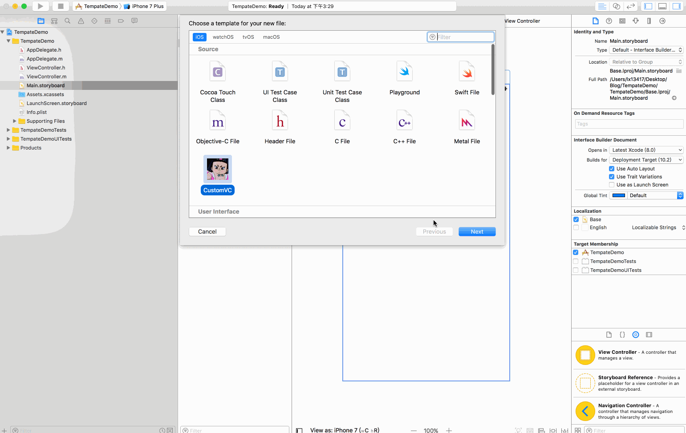
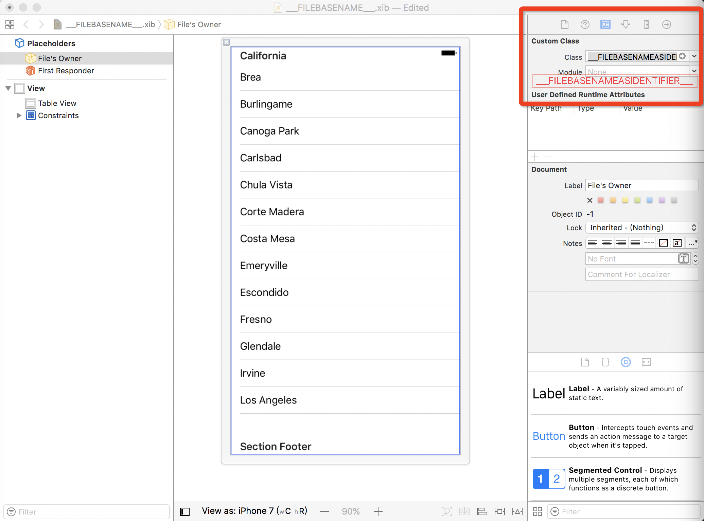
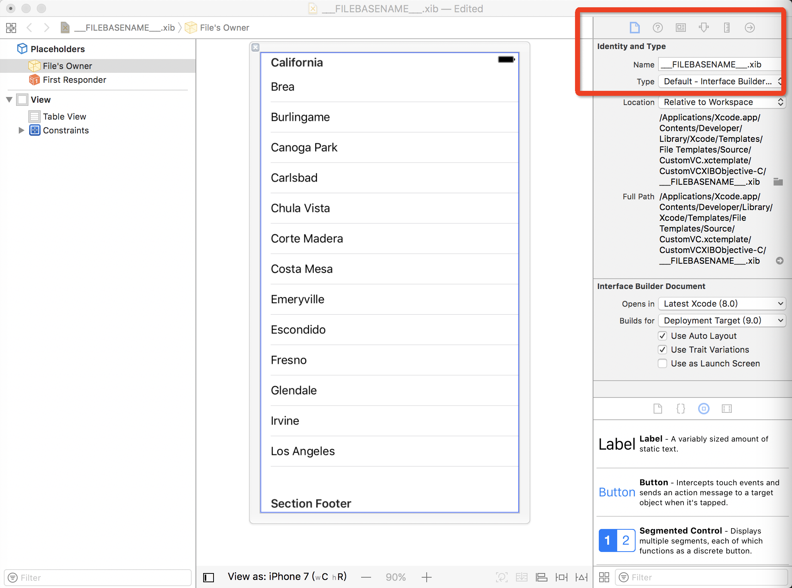

# 自定义 Xcode ViewController 类模板

话不多说我们先来体验下 :



### 什么是 Xcode 类模板 ？
说到 Xcode 类模板有些人可能觉得陌生，其实作为一名 iOS 开发，我们每天都会用到 Xcode 类模板，例如创建一个 UIViewController，一个 Category 等等，这些其实都是 Xcode 帮我们集成好的模板。

<a name="options" style="color:#666;border-bottom:none;">创建系统 VC 模版 :</a>


### 为什么要自定义 Xcode 类模板 ？
当我们用 Xcode 自带的模板创建一个 UIViewController 的子类时，我们会发现 `.m` 文件会多出一些方法 :


而我们平时的开发中，或多或少都有自己的一些规范，尤其是在多人合作开发的情况下，一些好的开发规范是相当必要的。

<a name="我的VC模版" style="color:#666;border-bottom:none;">我的 UIViewController 规范</a> :

```objc
#import "MyViewController.h"

@interface MyViewController ()
// <UITableViewDelegate,UITableViewDataSource>

@end

@implementation MyViewController

#pragma mark - LifeCyle

- (void)viewDidLoad {
[super viewDidLoad];
}
/*
- (void)viewWillAppear:(BOOL)animated {
[super viewWillAppear:animated];
}

- (void)viewDidAppear:(BOOL)animated {
[super viewDidAppear:animated];
}

- (void)viewWillDisappear:(BOOL)animated {
[super viewWillDisappear:animated];
}

-(void)viewDidDisappear:(BOOL)animated {
[super viewDidDisappear:animated];
}
**/
- (void)dealloc {
NSLog(@"%@-释放了",self.class);
}

#pragma mark - Intial Methods

#pragma mark - Target Methods

#pragma mark - Private Method

#pragma mark - Setter Getter Methods

#pragma mark - External Delegate

#pragma mark - UITableViewDelegate,UITableViewDataSource
/*
- (NSInteger)numberOfSectionsInTableView:(UITableView *)tableView {
return <#section#>;
}

- (NSInteger)tableView:(UITableView *)tableView numberOfRowsInSection:(NSInteger)section {
return <#row#>;
}

- (UITableViewCell *)tableView:(UITableView *)tableView cellForRowAtIndexPath:(NSIndexPath *)indexPath {
return <# UITableViewCell #>;
}

- (CGFloat)tableView:(UITableView *)tableView heightForRowAtIndexPath:(NSIndexPath *)indexPath {
return <#height#>;
}
**/
@end

```
这么一堆东西写起来也是要点时间的，如果每创建个 VC 就要写一遍也太不优雅了。

**有没有什么办法能够在我们创建 VC 的时候自动生成这些呢？**

### 创建自己的 Xcode 类模板
一份成品模版结构大概这样 :


介绍下里面的东西 (`xxx` 就是你自定义模版的名字) :

> xxx.xctemplate：模版文件。
> 
> xxxObjective-C：OC 模版文件，里面包含 `___FILEBASENAME___.h` 和 `___FILEBASENAME___.m` 两个文件。
> 
> xxxXIBObjective-C：比 `xxxObjective-C` 多了个 `___FILEBASENAME___.xib` 文件，可自定义。
> 
> xxxSwift：Swift模版文件，里面包含一个 `___FILEBASENAME___.swift` 文件。
> 
> xxxXIBSwift：比 `xxxSwift ` 多了个 `___FILEBASENAME___.xib` 文件，可自定义。
> 
> TemplateIcon.png：模版显示的图片。
> 
> TemplateInfo.plist：模版的配置信息，[介绍](#TemplateInfo.plist)。

重新写一份模版太繁琐，我们直接拷贝一份系统的模版来修改 ：

* 拷贝 `Cocoa Class.xctemplate`，修改名称并删除不需要的文件。（我这边是  `Xcode 8.2.1`, 以后路径可能有变）

```
/Applications/Xcode.app/Contents/Developer/Platforms/iPhoneOS.platform/Developer/Library/Xcode/Templates/File Templates/Source
```

* 修改 `.h` 为 ：

```objc
//  ___FILENAME___
//  ___PROJECTNAME___
//
//  Created by ___FULLUSERNAME___ on ___DATE___.
//___COPYRIGHT___
//

___IMPORTHEADER_cocoaSubclass___

@interface ___FILEBASENAMEASIDENTIFIER___ : UIViewController

@end
```
* 修改 `.m` 只需要添加自己需要的规范就行，可以参考 **[我的VC模版](#我的VC模版)**。
* 修改 `.swift` 为: 

```	objc
//  ___FILENAME___
//  ___PROJECTNAME___
//
//  Created by ___FULLUSERNAME___ on ___DATE___.
//___COPYRIGHT___
//

import UIKit

class ___FILEBASENAMEASIDENTIFIER___: UIViewController {

//MARK: - LifeCyle

override func viewDidLoad() {
super.viewDidLoad()
}

deinit {
print("\(object_getClassName(self)) - 释放了!")
}

//MARK: - Intial Methods

//MARK: - Target Methods

//MARK: - Private Method

//MARK: - Setter Getter Methods

//MARK: - External Delegate

}

```

* 新建 `.xib` 重命名 `___FILEBASENAME___.xib` 并按照下图修改:






上面 `.h` `.m` 里面 有些词可能不明白，这里再稍稍解释下：

> 1）DATE：标识当前时间；
> 
> 2）FILENAME：带文件后缀的全名；
> 
> 3）FILEBASENAME：不带文件后缀的名字；
> 
> 4）FULLUSERNAME：当前的用户名；
> 
> 6）PROJECTNAME：工程名字；
> 
> 7）FILEBASENAMEASIDENTIFIER：VC类名称；
> 
> 8）IMPORTHEADER_cocoaSubclass：导入的头文件。


#### <a name="TemplateInfo.plist" style="color:#666;border-bottom:none;">TemplateInfo.plist</a>


讲解一些需要改动的东西 :
> **SortOrder：**模版在界面中的位置；
> 
> **Options：**对应 **[图中](#options)** 四行；
> 
> **FallbackHeader：**`.h` 导入的头文件；
> 
> **RequiredOptions -> cocoaSubclass：**是否支持选择 xib；`Default` 默认 `true` 自动勾选；
> 
> **Values：**自定义模版的名称(一定要保持一致);
> 
> **Suffixes：**模版默认类名，效果如下图。


最后把创建好的 `xxx.xctemplate` 文件直接拷贝到系统路径下就可以直接使用了:

```
/Applications/Xcode.app/Contents/Developer/Platforms/iPhoneOS.platform/Developer/Library/Xcode/Templates/File Templates/Source	
```

### 修改系统模板
平常开发中，我们经常用`xib`来画一个`View`，之前用系统的模板创建`View`的时候是有勾选是否创建对应`xib`的这个选项的，苹果不知道什么时候改了，现在貌似不行了：


这样导致我们创建完`View`后，还需要再创建个对应的`xib`文件，简直神烦！
怎么能自动创建`xib`文件呢？我们完全可以修改系统的模板来满足我们的刚需：

* 进入目录，找到`Cocoa Touch Class.xctemplate`文件
```
/Applications/Xcode.app/Contents/Developer/Platforms/iPhoneOS.platform/Developer/Library/Xcode/Templates/File Templates/Source	
```
* 拷贝一份 `UIViewObjective-C`文件并改名为`UIViewXIBObjective-C`，然后到其他有`xib`的文件夹里面，拷贝一份`xib`到`UIViewXIBObjective-C`里面，`xib`可自行修改。（我这里只配置了`Objective-C`的，`Swift`步骤类似）
* 找到 当前目录的`TemplateInfo.plist`文件，如下修改：


* 重新创建系统 `View`模板：


大功告成！

### 参考链接
[http://www.jianshu.com/p/93527682d8d3](http://www.jianshu.com/p/93527682d8d3)

[http://www.bobmccune.com/2012/03/04/creating-custom-xcode-4-file-templates/](http://www.bobmccune.com/2012/03/04/creating-custom-xcode-4-file-templates/)
